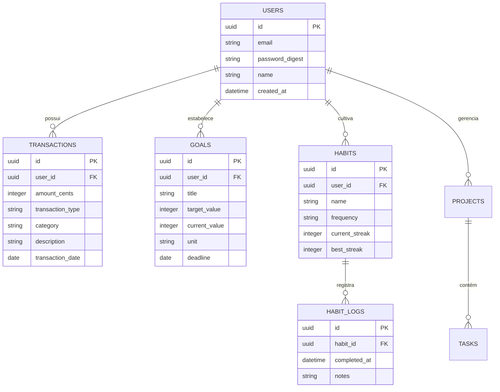

# Technical Architecture - Navi

Este documento detalha o design de sistema, fluxo de dados e integrações planejadas para o **Navi**.

---

## 1. Visão Geral da Arquitetura

O Navi é estruturado como um monorepo, unindo o aplicativo móvel (React Native/Expo), o painel web administrativo/dashboard (React/Vite), a API REST central (Ruby on Rails) e pacotes compartilhados em TypeScript.

```mermaid
graph TD
    subgraph Client Apps
        A[Mobile App - Expo] -->|HTTPS / JSON| C(Rails API)
        B[Web Dashboard - Vite] -->|HTTPS / JSON| C
    end

    subgraph Backend Services
        C -->|Active Record| D[(Neon Serverless PostgreSQL)]
        C -->|Gemini API SDK| E[Google Gemini AI]
    end

    subgraph Shared Node Packages
        F[@navi/types] -.-> A
        F -.-> B
        G[@navi/shared] -.-> A
        G -.-> B
    end
```

---

## 2. Estratégia de Inteligência Artificial

A inteligência artificial do Navi funcionará como o ponto de entrada principal para a criação e gerenciamento de registros de finanças, hábitos, metas e projetos.

### Fluxo de Conversação (Conversa Natural)
1. **Envio**: O usuário envia uma frase em linguagem natural no chat (ex: *"Acabei de gastar R$ 30 com transporte"*).
2. **Processamento**: A API do Rails recebe a mensagem e a encaminha para a **API do Gemini** estruturando a resposta com **Structured Outputs** (JSON).
3. **Mapeamento de Ações**:
   - A IA identifica a intenção como `CREATE_TRANSACTION`.
   - Extrai as entidades: `amount: 3000` (em centavos), `description: "transporte"`, `category: "Transporte"`.
4. **Execução**: O Rails valida a transação, persiste no Neon PostgreSQL e retorna um JSON estruturado de confirmação para o aplicativo.
5. **Interface**: O app renderiza dinamicamente a confirmação e atualiza os gráficos locais.

---

## 3. Banco de Dados (Neon Serverless PostgreSQL)

A escolha do **Neon** permite escalabilidade serverless com excelente latência e suporte a branches de desenvolvimento.

### Modelo de Dados Inicial Planejado


