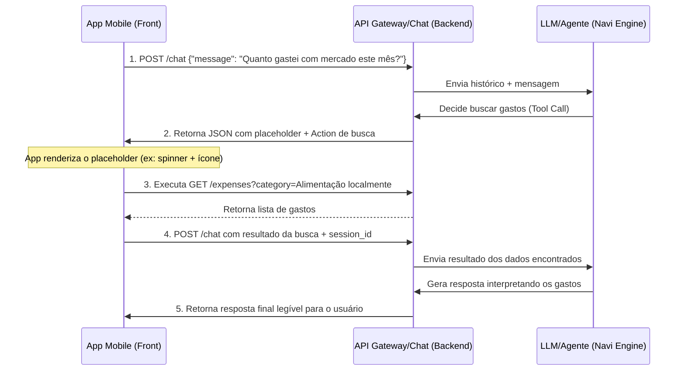

# API REST - Endpoint de Chat & Loop do Agente (Chat Agent Loop)

Este endpoint gerencia a interação por chat entre o usuário e o Agente da Navi. O fluxo utiliza uma arquitetura de **Client-Side Tool Execution** (Execução de Ações no Cliente) em múltiplas etapas, onde o agente retorna ações (Actions) para o aplicativo executar localmente e retornar o contexto para que o agente continue o raciocínio.

---

## Rota do Chat
* **Método:** `POST`
* **Rota:** `/api/v1/chat`
* **Headers:**
  ```http
  Authorization: Bearer <token_jwt>
  Content-Type: application/json
  Accept: text/event-stream
  ```

---

## 1. Fluxo de Interação (Passo a Passo)



---

## 2. Estrutura de Payload e Eventos

### Passo A: Início da Conversa (Envio do Usuário)
O usuário faz a pergunta inicial.

**Payload:**
```json
{
  "message": "Quanto gastei com mercado este mês?"
}
```

### Passo B: Resposta Intermediária da API (Action & Placeholder)
O agente percebe que precisa de dados para responder e emite uma resposta intermediária de processamento.

**Event Stream / JSON Response (200 OK):**
```json
{
  "session_id": "chat_sess_9a8f27b",
  "status": "processing",
  "message": "Entendido. Vou verificar isso para você agora.",
  "placeholder": {
    "type": "searching_expenses",
    "icon": "fastfood",
    "text": "Buscando gastos de Alimentação",
    "params": {
      "category": "Alimentação",
      "start_date": "2026-06-01",
      "end_date": "2026-06-30"
    }
  },
  "actions": [
    {
      "id": "action_req_01",
      "type": "search_expenses",
      "params": {
        "category": "Alimentação",
        "start_date": "2026-06-01",
        "end_date": "2026-06-30"
      }
    }
  ]
}
```

#### Regras do Placeholder para o Front-End:
* O front-end intercepta o objeto `placeholder` para exibir um feedback visual de progresso dinâmico (ex: `🔍 [Ícone fastfood] Buscando gastos de Alimentação...`).
* O `icon` é sempre um slug compatível com **Material Icons** do Expo.

---

### Passo C: Envio dos Resultados do Cliente (Retorno ao Agente)
O aplicativo executa as ações listadas no array `actions` chamando as APIs locais do backend (ex: `GET /api/v1/expenses`) e submete os resultados de volta para o chat, referenciando o `session_id`.

**Payload:**
```json
{
  "session_id": "chat_sess_9a8f27b",
  "action_results": [
    {
      "action_id": "action_req_01",
      "status": "success",
      "data": [
        { "date": "2026-06-05", "category": "Alimentação", "description": "Supermercado A", "amount": "150.00" },
        { "date": "2026-06-12", "category": "Alimentação", "description": "Lanche B", "amount": "45.50" }
      ]
    }
  ]
}
```

---

### Passo D: Resposta Final do Agente
O agente recebe o contexto dos dados coletados, calcula o total e retorna a mensagem conclusiva para o usuário.

**Event Stream / JSON Response (200 OK):**
```json
{
  "session_id": "chat_sess_9a8f27b",
  "status": "completed",
  "message": "Você gastou um total de R$ 195,50 com alimentação (mercado) este mês até agora.",
  "actions": []
}
```

---

## 3. Tipos de Ações Suportadas (`actions`)

O array `actions` suporta os seguintes tipos de operações para que o cliente execute e atualize o agente:

### A. Busca de Gastos (`search_expenses`)
Solicita consulta a gastos do usuário.
* **Params:**
  * `category` (string, opcional): Categoria específica.
  * `start_date` (string, opcional): Formato `YYYY-MM-DD`.
  * `end_date` (string, opcional): Formato `YYYY-MM-DD`.

### B. Adicionar Gasto (`create_expense`)
Solicita criação de um gasto.
* **Params:**
  * `date` (string): Formato `YYYY-MM-DD`.
  * `category` (string): Nome da categoria.
  * `description` (string, opcional): Descrição textual.
  * `amount` (number/string): Valor decimal.

### C. Ajustar/Criar Orçamento (`set_budget`)
Solicita a criação ou ajuste do limite de orçamento mensal.
* **Params:**
  * `date` (string): Mês/ano de referência (será normalizado para o dia 1 no backend).
  * `amount` (number/string): Valor limite.
