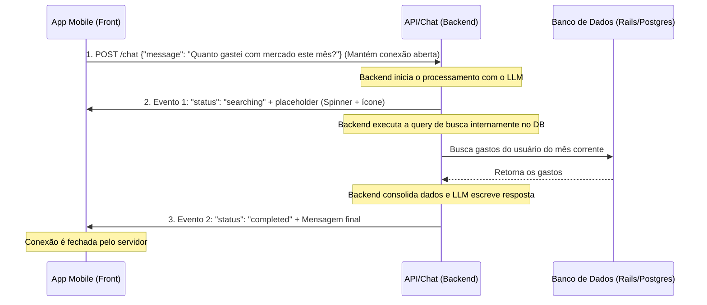

# API REST - Endpoint de Chat & Loop do Agente via Streaming (Chat Streaming)

Este endpoint gerencia a interação por chat entre o usuário e o Agente da Navi. O fluxo utiliza uma conexão de **Streaming de Eventos (Server-Sent Events - SSE)** de etapa única ou dupla no mesmo canal HTTP. O próprio backend processa as buscas no banco de dados e envia os status e respostas de forma sequencial pela conexão ativa.

Para evitar loops infinitos de agentes e desperdício de tokens, existe um **limite estrito de no máximo 2 eventos enviados pelo servidor por conexão/pergunta**:
1. **Mensagem de Ação/Carregamento** (se aplicável): Contém o estado de busca/processamento com um placeholder estruturado para o front-end exibir um feedback visual imediato.
2. **Mensagem de Resposta Final**: Contém a conclusão legível e formatada para o usuário após a conclusão da consulta.

---

## Rota do Chat
* **Método:** `POST`
* **Rota:** `/api/v1/chat`
* **Headers:**
  ```http
  Authorization: Bearer <token_jwt>
  Content-Type: application/json
  Accept: text/event-stream
  ```

---

## 1. Fluxo de Interação (Passo a Passo)



---

## 2. Estrutura de Payload e Eventos

### Passo A: Requisição Inicial do Usuário
O usuário faz a pergunta inicial. O app mantém a conexão HTTP aberta ouvindo os eventos do stream.

**Payload:**
```json
{
  "message": "Quanto gastei com mercado este mês?"
}
```

---

### Passo B: Evento 1 - Busca/Processamento (Opcional - Máx. 1 por stream)
Enviado imediatamente quando o backend identifica que precisa realizar uma consulta para responder. Contém a informação estruturada para o front-end saber o que está acontecendo e mostrar o placeholder correto.

**SSE Chunk (Event: `message`):**
```json
{
  "session_id": "chat_sess_9a8f27b",
  "status": "searching",
  "message": "Buscando gastos da categoria Alimentação...",
  "placeholder": {
    "type": "searching_expenses",
    "icon": "fastfood",
    "params": {
      "category": "Alimentação",
      "start_date": "2026-06-01",
      "end_date": "2026-06-30"
    }
  }
}
```

#### Regras do Placeholder para o Front-End:
* O front-end intercepta o objeto `placeholder` e exibe um estado de carregamento amigável para o usuário.
* O `icon` é um slug compatível com **Material Icons** do Expo (ex: `fastfood` para alimentação, `directions-car` para transporte, etc.), permitindo que o aplicativo estilize com cores e ícones correspondentes em tempo real.
* Exemplos de placeholders recomendados:
  * Buscando gastos da categoria `[icone] x`: `{ "type": "searching_expenses", "icon": "fastfood", "params": { "category": "x" } }`
  * Buscando gastos de data `x` até data `y`: `{ "type": "searching_expenses", "icon": "date-range", "params": { "start_date": "x", "end_date": "y" } }`

---

### Passo C: Evento 2 - Resposta Final (Obrigatório - Máx. 1 por stream)
Enviado após o backend processar os dados obtidos das consultas internas e gerar a conclusão textual. Após este evento, a conexão é encerrada.

**SSE Chunk (Event: `message`):**
```json
{
  "session_id": "chat_sess_9a8f27b",
  "status": "completed",
  "message": "Você gastou um total de R$ 195,50 com alimentação (mercado) este mês até agora."
}
```

---

## 3. Diretrizes de Segurança e Prevenção de Loops Infinitos (Regras do Agente)

Para garantir a eficiência e segurança:
1. **Sem Loops Recursivos no Servidor**: O agente no backend não pode solicitar ações em cadeia que excedam o limite estabelecido de 2 eventos de retorno.
2. **Sem Exposição de Identificadores Internos**: Conforme a regra de segurança geral da aplicação, nenhum dos eventos estruturados transmitidos no stream de chat deve expor `user_id` ou chaves internas de banco de dados.
